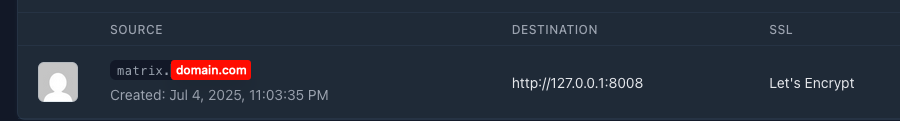
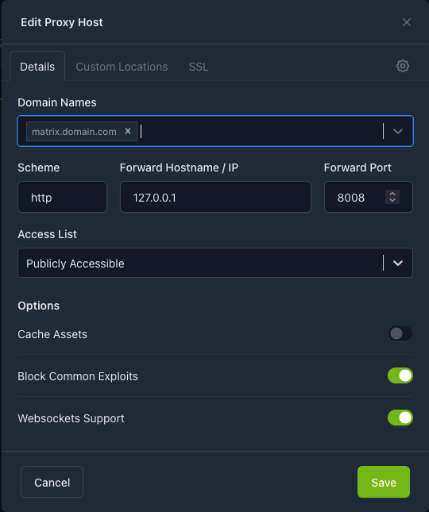
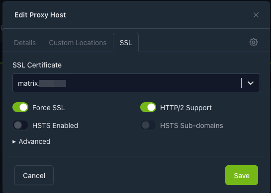
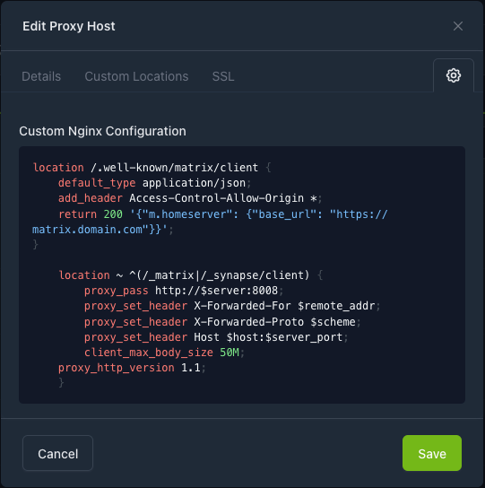

# Nginx Proxy Manager setup
<br>




```bash
location /.well-known/matrix/client {
    default_type application/json;
    add_header Access-Control-Allow-Origin *;
    return 200 '{"m.homeserver": {"base_url": "https://matrix.domain.com"}}';
}

    location ~ ^(/_matrix|/_synapse/client) {
        proxy_pass http://$server:8008;
        proxy_set_header X-Forwarded-For $remote_addr;
        proxy_set_header X-Forwarded-Proto $scheme;
        proxy_set_header Host $host:$server_port;
        client_max_body_size 50M;
    proxy_http_version 1.1;
    }
```